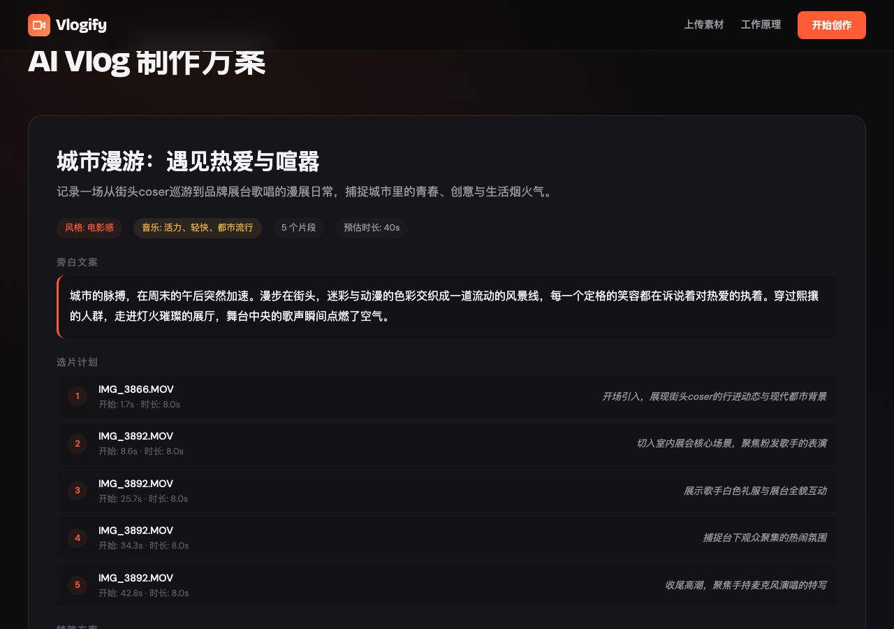
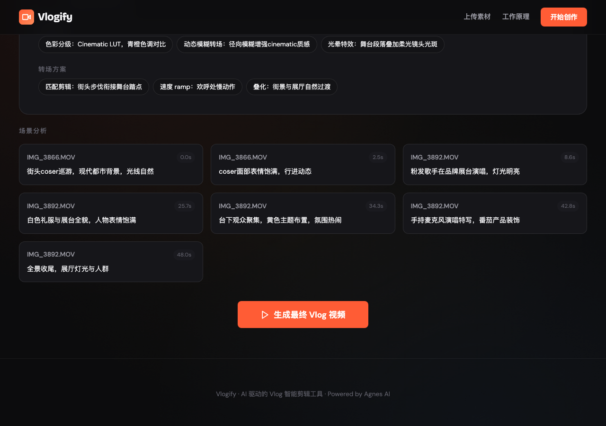
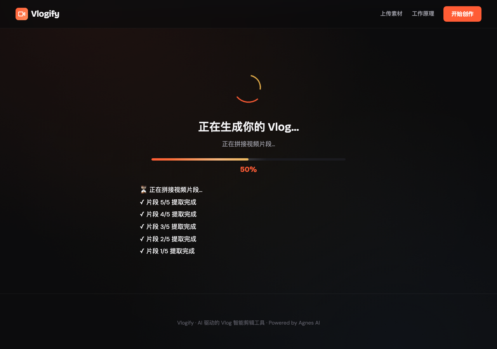
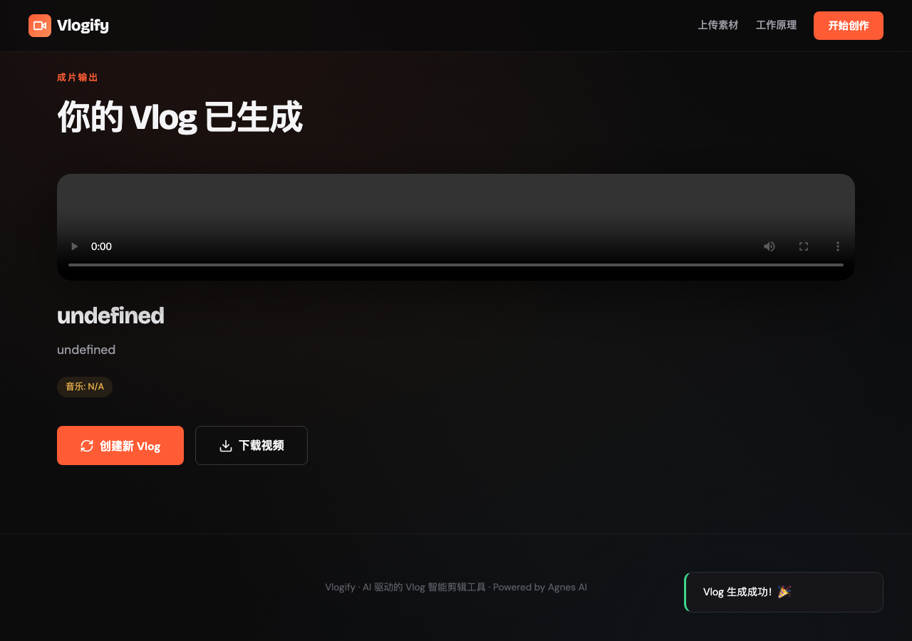

# Vlogify — AI Vlog 智能剪辑工具

> 上传视频素材，AI 自动理解内容、选取高光、生成旁白字幕、配乐特效，一键输出成片。

## 🎬 项目简介

Vlogify 是一个基于 Web 的 AI Vlog 自动剪辑工具。不同于 Looki 需要佩戴专用相机，Vlogify 让你直接上传手机拍摄的短视频，AI 会自动完成：

1. **理解视频内容** — 提取关键帧，多模态 AI 分析每个画面
2. **智能选片** — AI 生成完整 Vlog 方案（选片/旁白/字幕/音乐/特效）
3. **自动剪辑** — ffmpeg 提取片段、拼接、烧录字幕、混入语音旁白、转场特效
4. **AI 生成封面** — 根据视频内容自动生成电影感封面图

## ✨ 功能特性

- 📤 **批量上传**：支持 MP4/MOV/AVI/MKV/WebM 等格式，单文件最大 500MB
- 🧠 **AI 场景理解**：Agnes 1.5-Flash 多模态分析每个关键帧
- 🎯 **智能选片**：Agnes 2.0-Flash（含 thinking）生成完整 Vlog 制作方案
- ✂️ **自动剪辑**：ffmpeg 提取精选片段、拼接、加字幕、配音、转场
- 🔊 **TTS 旁白**：edge-tts 生成中文语音旁白（晓晓音色），macOS `say` 作为回退
- 🖼️ **AI 封面**：Agnes Image 2.1 自动生成 Vlog 封面图
- 🎨 **6 种风格**：电影感 / 活力节奏 / 宁静日常 / 旅行游记 / 纪录片 / 创意混剪
- 📊 **实时进度**：SSE 流式推送每个处理阶段的进度

## 🖥️ 界面预览

### 1. 上传页面


拖拽或点击上传视频素材，支持批量上传。

### 2. 风格选择


选择 Vlog 风格和主题，AI 会根据风格调整剪辑策略。

### 3. AI 分析中


Agnes AI 正在提取关键帧并理解视频内容，实时显示进度。

### 4. 分析结果



AI 生成的完整 Vlog 方案：标题、摘要、旁白文案、选片计划、特效和转场方案。

### 5. 场景分析详情



每个关键帧的详细分析，包括时间、画面描述和场景理解。

### 6. 生成进度



SSE 流式推送的实时处理进度：片段提取 → 拼接 → 字幕 → 旁白 → 转场 → 封面生成。

### 7. 最终成片



生成的 Vlog 视频可直接预览和下载，附带 AI 生成的封面图。

## 🏗️ 架构

```
用户上传视频 → ffmpeg 提取关键帧 → Agnes 1.5-Flash 多模态分析场景
→ Agnes 2.0-Flash (thinking) 生成 Vlog 方案（选片/旁白/字幕/音乐/特效）
→ ffmpeg 提取片段 + 拼接 + 烧录字幕 + 混入 TTS 旁白 + 转场特效
→ Agnes Image 2.1 生成封面 → 输出最终视频
```

### 技术栈

| 组件 | 技术 |
|------|------|
| 后端 | Node.js + Express |
| AI 引擎 | Agnes AI（1.5-Flash / 2.0-Flash / Image 2.1） |
| 视频处理 | ffmpeg（片段提取/拼接/字幕/混音/转场） |
| TTS | edge-tts（晓晓音色）+ macOS say 回退 |
| 前端 | 原生 HTML/CSS/JS，暗色电影感设计 |
| 通信 | SSE（Server-Sent Events）实时进度推送 |

### 处理流程

```
上传视频 (POST /api/upload)
    ↓
分析视频 (POST /api/analyze)
    ├── ffmpeg 提取关键帧（每 2 秒一帧）
    ├── Agnes 1.5-Flash 逐帧分析场景
    └── Agnes 2.0-Flash 生成 Vlog 方案
    ↓
生成视频 (POST /api/generate, SSE)
    ├── Step 1: 提取精选片段 (35%)
    ├── Step 2: 拼接视频 (15%)
    ├── Step 3: 烧录字幕 (15%)
    ├── Step 4: TTS 旁白 + 混音 (15%)
    ├── Step 5: 转场特效 (10%)
    └── Step 6: AI 封面生成 (10%)
    ↓
输出最终视频 + 封面图
```

## 🚀 快速开始

### 前置要求

- Node.js 18+
- ffmpeg（已安装并可在 PATH 中使用）
- Agnes AI API Key

### 安装

```bash
# 克隆仓库
git clone https://github.com/vvlife/vlogify.git
cd vlogify

# 安装依赖
npm install

# 配置环境变量
cp .env.example .env
# 编辑 .env，填入 Agnes API Key
# AGNES_API_KEY=your_api_key_here

# 启动服务器
npm start
```

服务器运行在 `http://localhost:3456`。

### 使用

1. 打开浏览器访问 `http://localhost:3456`
2. 上传一个或多个短视频文件
3. 选择 Vlog 风格和主题
4. 等待 AI 分析并查看生成方案
5. 点击"生成最终 Vlog 视频"
6. 预览并下载成片

## 📁 项目结构

```
vlogify/
├── server.js           # Express 服务器（API + 视频处理）
├── public/
│   └── index.html      # 前端单页应用
├── package.json
├── .env                # 环境变量（API Key）
├── docs/               # README 截图
├── uploads/            # 上传的视频文件（运行时生成）
├── temp/               # 临时处理文件（运行时生成）
└── outputs/            # 最终输出视频（运行时生成）
```

## ⚙️ 配置

### 环境变量

| 变量名 | 说明 | 默认值 |
|--------|------|--------|
| `AGNES_API_KEY` | Agnes AI API Key | — |
| `PORT` | 服务器端口 | 3456 |

### ffmpeg 依赖

确保系统已安装 ffmpeg：

```bash
# macOS
brew install ffmpeg

# Ubuntu/Debian
sudo apt install ffmpeg

# Windows
# 下载 https://ffmpeg.org/download.html
```

## 🎨 支持的风格

| 风格 | 说明 |
|------|------|
| 🎬 电影感 | Cinematic LUT，青橙色调，动态模糊转场 |
| ⚡ 活力节奏 | 快节奏剪辑，明快色彩，节奏感强 |
| 🌿 宁静日常 | 柔和色调，缓慢叠化，安静旁白 |
| ✈️ 旅行游记 | 广角感觉，地图动画，轻快音乐 |
| 📹 纪录片 | 写实风格，低饱和度，沉稳旁白 |
| 🎭 创意混剪 | 快闪风格，特效密集，节奏多变 |

## 🔧 API 文档

### `POST /api/upload`
上传视频文件，返回 sessionId 和文件信息。

### `POST /api/analyze`
分析视频内容，返回 AI 生成的 Vlog 方案。

### `POST /api/generate` (SSE)
生成最终视频，通过 SSE 推送实时进度。

**事件类型：**
- `progress` — 处理进度（progress, step）
- `done` — 完成（output.videoUrl, output.coverUrl）
- `error` — 错误（error）

### `GET /api/health`
健康检查，返回服务器状态、Agnes 配置和 ffmpeg 可用性。

## 📝 License

MIT

## 🙏 Acknowledgments

- [Agnes AI](https://agnes-ai.space) — 多模态 AI 引擎
- [ffmpeg](https://ffmpeg.org/) — 音视频处理
- [edge-tts](https://github.com/rany2/edge-tts) — 微软 Edge TTS 语音合成
